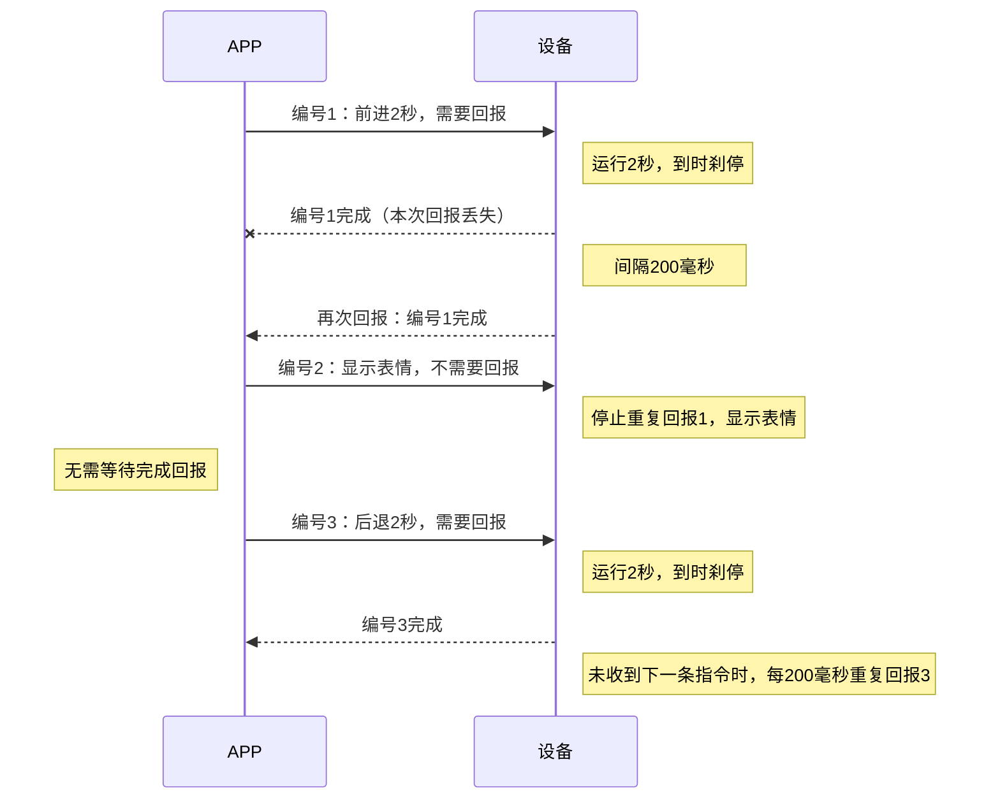

# 小白控制功能需求

> 来源：`docs/小白控制功能表.xlsx`（Sheet1）

## 1. 其他要改的内容

1. 动力模式和感应模式按键交换位置。
2. 遥控加速减速键位调换。
3. 呼吸灯的亮灭跟随语音唤醒状态。
4. 电机指令结束时，电机刹停。
5. 改词条，去掉“进入”，改成“遥控模式”/“动力模式”。

## 2. 模式切换需求

| 事件 | 需求 |
| --- | --- |
| 进入编程模式 | APP 打开编程界面时发送“进入编程模式”指令，然后设备进入编程模式、暂停电机，并播报“进入编程模式”。如果已经在编程模式，不再理会指令和播报。 |
| 退出编程模式 | 当设备在编程模式时，用户可以点击设备上的实体按键退出编程模式。然后设备暂停电机、中断用户的编程指令、进入对应的按键模式，并回报“退出编程模式”。退出编程模式后，除了新的“进入编程模式”指令外，其他编程指令不再理会。 |
| 进入手机遥控模式 | APP 打开遥控界面并发送“进入遥控模式”指令时，设备切换到遥控模式。 |
| 手机蓝牙断开 | 当设备在编程模式时，若蓝牙断开，则退出编程模式。 |

## 3. 编程模式下的指令

| 类别 | 功能 | 选项 | 参数 | 回报 | 解释 |
| --- | --- | --- | --- | --- | --- |
| 电机 | 电机正转指定时间 | 左电机/右电机 | 时间，限幅正值 | 回报完成 | 指定电机正转，由设备计时，到时刹停并回报完成，APP 再执行下一步。 |
| 电机 | 电机反转指定时间 | 左电机/右电机 | 时间，限幅正值 | 回报完成 | 指定电机反转，由设备计时，到时刹停并回报完成，APP 再执行下一步。 |
| 电机 | 电机持续正转 | 左电机/右电机 | / | — | 指定电机持续正转。 |
| 电机 | 电机持续反转 | 左电机/右电机 | / | — | 指定电机持续反转。 |
| 电机 | 电机停止 | 左电机/右电机 | / | — | 刹停指定电机。 |
| 电机 | 电机功率 | 1档/2档/3档 | / | — | 设置所有单电机控制的功率档位，未设置时默认 3 档。 |
| 组合电机 | 前进指定时间 | / | 时间，限幅正值 | 回报完成 | 前进，由设备计时，到时刹停并回报完成，APP 再执行下一步。 |
| 组合电机 | 左转指定时间 | / | 时间，限幅正值 | 回报完成 | 左转，由设备计时，到时刹停并回报完成，APP 再执行下一步。 |
| 组合电机 | 右转指定时间 | / | 时间，限幅正值 | 回报完成 | 右转，由设备计时，到时刹停并回报完成，APP 再执行下一步。 |
| 组合电机 | 后退指定时间 | / | 时间，限幅正值 | 回报完成 | 后退，由设备计时，到时刹停并回报完成，APP 再执行下一步。 |
| 组合电机 | 持续移动 | 前进/左转/右转/后退 | / | — | 按选定方向持续运行。后续单独控制一个电机时，另一电机保持原动作。 |
| 组合电机 | 组合电机停止 | / | / | — | 刹停两个电机。 |
| 组合电机 | 组合电机功率 | 1档/2档/3档 | / | — | 设置所有组合电机控制的功率档位，未设置时默认 3 档。 |
| 感应 | 等待红外 | 大于/小于 | 输入数值，限幅 0-100 | 回报完成 | 等待红外数值满足设定条件后回报完成，APP 再执行下一步。 |
| 动态类 | 显示指定表情 | 10个选项 | / | — | 显示所选表情，保持到收到新的显示指令。 |
| 动态类 | 显示指定数字 | / | 输入数值，限幅 0-100 | — | 显示指定数字，保持到收到新的显示指令。 |
| 动态类 | 关闭显示 | / | / | — | 关闭当前表情或数字显示。 |
| 动态类 | 语音播报词条 | 10个选项 | / | — | 播放所选语音词条。 |
| 动态类 | 等待词条 | 10个选项 | / | 回报完成 | 等待识别到指定词条后回报完成，APP 再执行下一步。 |
| 控制 | 停止程序 | / | / | — | APP 结束程序，设备刹停全部电机，取消电机计时、红外等待和词条等待。 |

## 4. 回报要求

1. 每条编程指令带编号，完成回报带上对应编号。
2. 需要回报的指令：任务完成后立即回报，之后每 200 毫秒重复回报。
3. 不需要回报的指令：直接执行，不发送完成回报。
4. 收到下一条新编号的编程指令后，停止上一条任务的重复回报，再执行新指令。无论新指令是否需要回报，都按此处理。

> **关键：** 编号 2 虽然不需要回报，但收到它后，也要停止编号 1 的重复回报。

### 4.1 回报流程示例

## 5. 播报词条

| ID | 播报词条 |
| --- | --- |
| P01 | 小白开始行动啦 |
| P02 | 跟我一起出发吧 |
| P03 | 前方道路畅通 |
| P04 | 我发现前面有东西 |
| P05 | 让我想一想 |
| P06 | 小心一点哦 |
| P07 | 太棒了，继续加油 |
| P08 | 我找到目标啦 |
| P09 | 挑战成功 |
| P10 | 我的表演结束啦 |

## 6. 识别词条

| ID | 识别词条 |
| --- | --- |
| ASR_01 | 开始 |
| ASR_02 | 下一步 |
| ASR_03 | 再来一次 |
| ASR_04 | 你好 |
| ASR_05 | 再见 |
| ASR_06 | 谢谢 |
| ASR_07 | 打开 |
| ASR_08 | 关闭 |
| ASR_09 | 前进 |
| ASR_10 | 后退 |

## 7. 表情

| ID | 表情 |
| --- | --- |
| EYE_01 | 待机 |
| EYE_02 | 开心 |
| EYE_03 | 生气 |
| EYE_04 | 伤心 |
| EYE_05 | 惊讶 |
| EYE_06 | 眨眼 |
| EYE_07 | 喜欢 |
| EYE_08 | 晕眩 |
| EYE_09 | 困倦 |
| EYE_10 | 好奇 |
